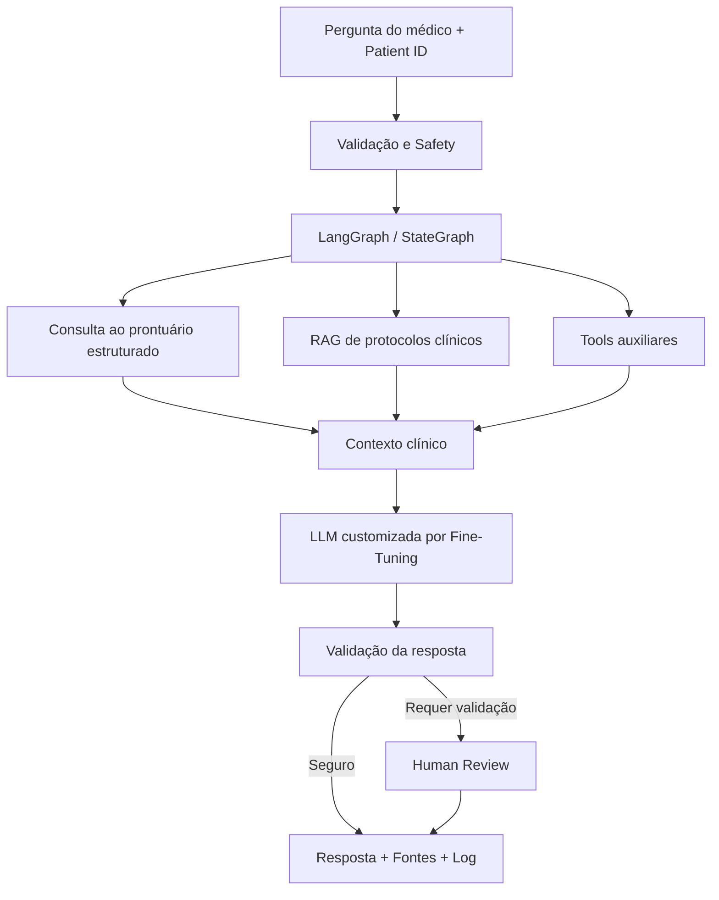

# MedFlow AI — Tech Challenge Fase 3

Assistente clínico acadêmico desenvolvido para o Tech Challenge da Fase 3 da Pós-Tech em IA para Devs (FIAP), integrando **fine-tuning de LLM**, **RAG**, **LangChain** e **LangGraph**.

> ⚠️ Projeto acadêmico e experimental. O sistema não substitui avaliação clínica, diagnóstico, prescrição ou decisão de profissionais de saúde.

## Objetivo

Construir um assistente virtual médico capaz de:

- utilizar uma LLM customizada por fine-tuning;
- consultar dados estruturados de pacientes sintéticos;
- recuperar protocolos e referências por RAG;
- contextualizar respostas com informações atualizadas do paciente;
- executar fluxos condicionais e seguros com LangGraph;
- registrar logs para auditoria;
- apresentar fontes e rastreabilidade das respostas;
- encaminhar situações sensíveis para validação humana.

## Arquitetura planejada



## Status do projeto

- [x] Repositório criado e estrutura inicial definida
- [x] Requisitos do Tech Challenge mapeados
- [x] Estratégia preliminar de datasets definida
- [ ] Dataset médico selecionado e versionado
- [ ] Dataset sintético de pacientes preparado
- [ ] Pipeline de preprocessing e anonimização
- [ ] Baseline da LLM
- [ ] Fine-tuning com LoRA/QLoRA
- [ ] Avaliação base vs. fine-tuned
- [ ] Pipeline RAG
- [ ] Avaliação do retrieval
- [ ] Base estruturada de pacientes
- [ ] Integração com LangChain
- [ ] Fluxo LangGraph
- [ ] Guardrails e validação humana
- [ ] Logging e auditoria
- [ ] Testes automatizados
- [ ] Relatório técnico final
- [ ] Vídeo de demonstração de até 15 minutos

## Estratégia de execução

O treinamento da LLM será priorizado no **Google Colab com GPU**, usando LoRA/QLoRA. Desenvolvimento de módulos, testes, documentação e revisão de código poderão ser executados localmente ou no Colab.

## Estrutura planejada

```text
.
├── .github/workflows/
├── artifacts/
├── data/
│   ├── processed/
│   ├── raw/
│   └── synthetic/
├── docs/
├── notebooks/
├── src/medflow_ai/
│   ├── database/
│   ├── evaluation/
│   ├── fine_tuning/
│   ├── graph/
│   ├── logging_utils/
│   ├── rag/
│   └── safety/
├── tests/
├── .env.example
├── .gitignore
├── pyproject.toml
└── requirements.txt
```

## Datasets candidatos

A estratégia atual considera combinar fontes diferentes conforme a finalidade:

- **MedQuAD**: pares de perguntas e respostas para instruction tuning;
- **PubMedQA**: benchmark biomédico e avaliação complementar;
- **PCDT / protocolos clínicos brasileiros**: corpus para RAG e possíveis exemplos supervisionados;
- **Synthea**: prontuários e registros totalmente sintéticos para a base estruturada do assistente.

A seleção final será documentada em `docs/DATASETS.md`.

## Requisitos da entrega

O checklist detalhado está em `docs/REQUIREMENTS_CHECKLIST.md` e será atualizado durante o desenvolvimento para garantir que nenhuma exigência do Tech Challenge seja esquecida.

## Desenvolvimento

```bash
git clone https://github.com/NirtonAfonso/tech-challenge-fase3-medflow-ai.git
cd tech-challenge-fase3-medflow-ai
python -m venv .venv
```

Windows PowerShell:

```powershell
.venv\Scripts\Activate.ps1
```

Linux/macOS:

```bash
source .venv/bin/activate
```

Instalação:

```bash
pip install -r requirements.txt
```

## Segurança e privacidade

- não versionar dados clínicos reais;
- utilizar apenas dados públicos, anonimizados ou sintéticos;
- nunca armazenar chaves de API no Git;
- pseudonimizar identificadores usados nos logs;
- impedir prescrição autônoma e outras decisões clínicas sem validação humana;
- registrar a fonte utilizada em respostas clínicas sempre que aplicável.

## Instituição

**FIAP — Pós-Tech em Inteligência Artificial para Desenvolvedores**  
Tech Challenge — Fase 3 — 2026
