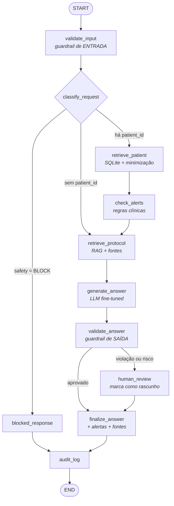

# Arquitetura — MedFlow AI

Documento vivo. O diagrama do grafo é **gerado a partir do código compilado**
(`python -m medflow_ai.cli graph`), de modo que não pode divergir da implementação.

---

## 1. Princípio de separação

Três responsabilidades que não se misturam (ADR-001):

| Camada | Responsabilidade | Fonte da verdade |
|---|---|---|
| **Fine-tuning** | formato, tom, comportamento de recusa | dataset SFT versionado |
| **RAG** | conhecimento documental rastreável e atualizável | corpus institucional |
| **Base estruturada** | dados atuais do paciente | SQLite |
| **LangGraph** | orquestração, condicionais, segurança, auditoria | código |

Nenhuma camada empresta responsabilidade de outra. A LLM não guarda dado de paciente; o RAG não
decide conduta; o banco não vai inteiro para o prompt.

---

## 2. Fluxo do grafo



### As três decisões condicionais

| # | Onde | Critério | Destinos |
|---|---|---|---|
| 1 | após `classify_request` | `safety_status == BLOCK` | `blocked_response` |
| 2 | após `classify_request` | existe `patient_id` | `retrieve_patient` ou `retrieve_protocol` |
| 3 | após `validate_answer` | `requires_human_review` | `human_review` ou `finalize_answer` |

A condicional 1 tem consequência observável importante: no caminho bloqueado, **`generate_answer`
nunca executa**. Nada é gerado antes do bloqueio — verificado por teste.

---

## 3. Estado compartilhado

`src/medflow_ai/graph/state.py`

```python
class MedicalState(TypedDict, total=False):
    trace_id: str
    question: str
    patient_id: str
    requested_k: int

    route: str
    safety_status: str                 # SAFE | CAUTION | HUMAN_REVIEW | BLOCK
    safety_rules: list[str]
    safety_rationales: list[str]
    requires_human_review: bool
    output_violations: list[str]

    patient_context: dict              # já pseudonimizado e minimizado
    patient_context_text: str
    retrieved_documents: list[dict]
    protocol_context_text: str
    sources: list[dict]
    alerts: list[dict]

    draft_answer: str
    answer: str
    errors: list[str]
    latency_ms: float
    metadata: dict

    processing_steps: Annotated[list[str], operator.add]   # reducer: concatena
```

`processing_steps` usa o reducer de concatenação do LangGraph: cada nó acrescenta seu nome, formando a
trilha de execução que vai para o log e para os testes de roteamento.

Cada nó devolve **apenas as chaves que alterou** — isso mantém os nós pequenos e testáveis com dublês.

---

## 4. Nós

| Nó | Responsabilidade | Falha tratada |
|---|---|---|
| `validate_input` | valida a pergunta, classifica risco, fixa versões de política e prompt | pergunta vazia → `BLOCK` |
| `classify_request` | escolhe a rota | — |
| `retrieve_patient` | consulta o prontuário e monta contexto minimizado | paciente inexistente ou banco ausente → registra erro e segue |
| `check_alerts` | aplica regras de valor crítico, interação e pendência urgente | sem contexto → pula |
| `retrieve_protocol` | RAG com fusão por rank (ADR-006), devolve trechos + fontes | exceção → segue sem fontes, resposta declara ausência |
| `generate_answer` | invoca a LLM com o prompt versionado | provedor indisponível → registra erro, não propaga |
| `validate_answer` | guardrail de saída; pode elevar a categoria de risco | — |
| `human_review` | prefixa aviso de rascunho pendente de validação | — |
| `blocked_response` | resposta padrão explicando o motivo do bloqueio | — |
| `finalize_answer` | anexa alertas e o bloco `FONTES CONSULTADAS` | — |
| `audit_log` | grava o evento JSON com latência e passos | — |

**Regra de resiliência:** nenhum nó propaga exceção. Falha vira `errors` no estado, o fluxo continua e
o evento de auditoria sai com `status: "error"`. Três testes cobrem isso (falha de LLM, falha de
retrieval, ausência de banco).

---

## 5. Componentes LangChain utilizados

| Componente | Uso |
|---|---|
| `Document` / Document Loaders | corpus Markdown por seção; `PyPDFLoader` para PDFs externos |
| `RecursiveCharacterTextSplitter` | chunking com separadores adequados a texto clínico |
| `Embeddings` | interface implementada por `HashingEmbeddings` e pelo wrapper de `sentence-transformers` |
| `VectorStore` | `MedFlowVectorStore` implementa a interface (utilizável com `.as_retriever()`) |
| `ChatPromptTemplate` | prompt clínico versionado |
| `BaseChatModel` | os três provedores (`template`, `hf_local`, `openai`) |
| `@tool` / `StructuredTool` | 4 ferramentas: prontuário, protocolo, pendências, alertas |

---

## 6. Camadas do pacote

```text
src/medflow_ai/
├── cli.py             interface de linha de comando (9 comandos)
├── config.py          configuração única por ambiente; nenhum módulo lê os.environ direto
├── data/              corpus, anonimização, curadoria
├── database/          esquema Synthea-compatível, gerador, ingestão, repositório
├── rag/               loaders, chunking, embeddings, vector store, 4 retrievers
├── llm/               prompts versionados, provedores intercambiáveis
├── graph/             state, nodes, tools, build
├── safety/            política clínica e guardrails
├── logging_utils/     trilha de auditoria com redação
├── fine_tuning/       config QLoRA, dataset, treino, avaliação comparável
└── evaluation/        rag_eval, safety_eval, database_eval, graph_eval
```

---

## 7. Critérios arquiteturais adotados

1. **Injeção de dependência em tudo.** `MedFlowNodes` recebe retriever, repositório, modelo e logger.
   É o que permite testar o grafo com um modelo que falha, um retriever quebrado ou sem banco.
2. **Configuração centralizada.** Só `config.py` lê variáveis de ambiente; caminhos relativos são
   ancorados na raiz do repositório, o que faz o projeto funcionar igual em local, CI e Colab.
3. **Determinismo por padrão.** Seed fixa, embedding determinístico, gerador de pacientes com seed,
   provedor `template` determinístico — as métricas do relatório são regeneráveis.
4. **Nenhum segredo em código.** Chaves só por ambiente; `.env` fora do Git.
5. **Minimização como arquitetura, não como filtro.** `PatientContext` sequer possui campos de
   identificação; não há o que vazar.
6. **Diagramas gerados do código.** `cli graph` extrai o Mermaid do grafo compilado.
7. **Falhar de forma segura.** Sem fonte recuperada, a resposta correta é declarar falta de evidência.

---

## 8. Fronteiras de confiança

```text
[médico] --pergunta--> [guardrail de entrada] --> [grafo]
                                                    |
                      [SQLite: PII fica aqui] <-----+ (só sai contexto minimizado)
                      [corpus: confiável]     <-----+
                                                    |
                                                    v
                                              [LLM: NÃO confiável]
                                                    |
                                          [guardrail de saída]
                                                    |
                                    [resposta + fontes] --> [médico]
                                                    |
                                          [auditoria: sem PII]
```

A LLM é tratada como componente **não confiável**: tudo que ela produz passa pelo guardrail de saída
antes de chegar ao médico, e nada identificável chega até ela.
