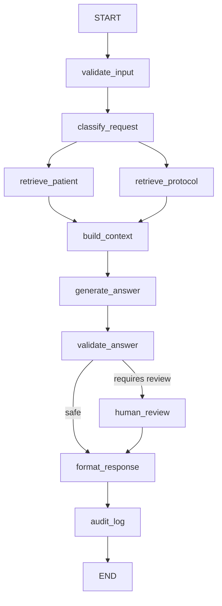

# Arquitetura planejada — MedFlow AI

## Princípio

Separar três responsabilidades:

1. **Fine-tuning:** adaptação do comportamento/formato de resposta da LLM.
2. **RAG:** conhecimento documental recuperável, atualizado e rastreável.
3. **LangGraph:** orquestração do fluxo, ferramentas, validação e estado.

## Fluxo de alto nível



## Estado compartilhado proposto

```python
class MedicalState(TypedDict, total=False):
    trace_id: str
    question: str
    patient_id: str
    patient_context: dict
    retrieved_documents: list
    sources: list
    answer: str
    safety_status: str
    requires_human_review: bool
    processing_steps: list[str]
```

## Camadas

### `fine_tuning/`
Preparação do dataset, formatação instruction/chat, QLoRA/LoRA, avaliação e exportação do adapter.

### `rag/`
Ingestão, chunking, embeddings, vector store, retrieval, reranking e rastreabilidade das fontes.

### `database/`
Carga e consulta de registros sintéticos de pacientes. Preferência inicial: SQLite alimentado por Synthea.

### `graph/`
Estado, nós, ferramentas e construção do `StateGraph`.

### `safety/`
Políticas de atuação, validação de entrada/saída e encaminhamento para revisão humana.

### `logging_utils/`
Logs estruturados sem identificadores pessoais diretos.

### `evaluation/`
Benchmarks do fine-tuning, retrieval/RAG, segurança e fluxo.

## Critérios arquiteturais

- dados clínicos reais não devem ser armazenados no repositório;
- segredos somente por variáveis de ambiente;
- cada nó deve ser pequeno e testável;
- respostas baseadas em protocolos devem carregar metadados de fonte;
- decisão clínica sensível deve permitir interrupção/validação humana;
- o sistema deve ser reprodutível no Colab sempre que possível.
